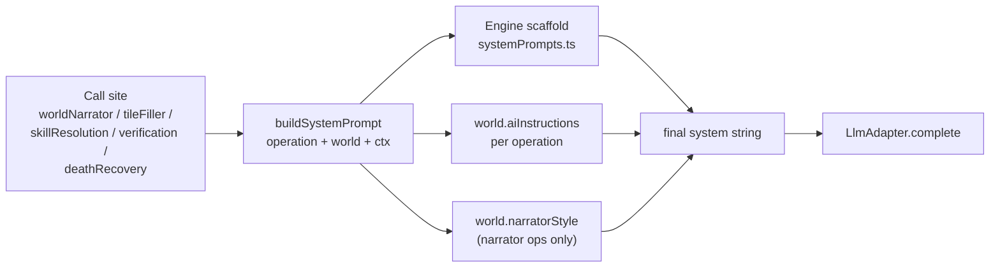

## Why

`world.aiInstructions` (e.g. `generateStory`, `generateActionInfo`, `generateLocationDetails`, ...) and the global `narratorStyle` exist in `packs/larion/larion.json` but are **never read** by the engine. Every `LlmAdapter.complete(...)` call site writes its own ad-hoc `system` string. The unused `[engine/src/llm/promptBuilder.ts](engine/src/llm/promptBuilder.ts)` is a vestigial first attempt. Result: pack authors edit `aiInstructions` and nothing changes in the model output.

## Design



Two new modules + one composer + per-call-site wiring.

## Step 1 — Schema: surface `narratorStyle`

`[engine/src/schema/worldSchema.ts](engine/src/schema/worldSchema.ts)`:

- Add `narratorStyle: z.string().default("")` next to `aiInstructions`.
- Keep `aiInstructions: z.record(z.string(), z.unknown()).default({})` as-is — block contents stay opaque (`string` or nested `{custom, "Style Principles", ...}` object).

## Step 2 — New `engine/src/llm/systemPrompts.ts`

One file owning every mechanics-side prompt. Each export is a pure function (state/world in, string out). Move the existing ad-hoc strings here verbatim so behavior is unchanged before composing. Suggested shape:

```typescript
export const ENGINE_PROMPTS = {
  storyTraversal: (state, intent, world) => string,
  storyScene: (state, world) => string,
  tileRegion: (input) => string, // moved from tileFiller.systemPromptForRegion
  tileLocation: (input) => string, // moved from tileFiller.systemPromptForLocation
  skillCheck: () => string, // moved from skillResolution
  questVerify: () => string, // moved from quests/verification
  deathRecovery: () => string, // generic header; world.death.instructions is appended per Step 3
};
```

Strip purely stylistic lines (e.g. `Style: present-tense, sensory…`, `NEVER acknowledge being an AI`) — those become the responsibility of the appended `aiInstructions`/`narratorStyle`. Keep mechanical/contractual lines (tool catalogue contract, JSON shape, coordinate convention, "do not emit move tool when impassable", etc.).

## Step 3 — Replace `promptBuilder.ts` with a real composer

Rewrite `[engine/src/llm/promptBuilder.ts](engine/src/llm/promptBuilder.ts)` so the unused stub becomes the canonical entry point.

```typescript
export type PromptOperation =
  | "story.traversal"
  | "story.scene"
  | "tile.region"
  | "tile.location"
  | "skill.check"
  | "quest.verify"
  | "death.recovery";

const OPERATION_TO_INSTRUCTIONS: Record<
  PromptOperation,
  {
    blocks: string[]; // keys into world.aiInstructions
    appendNarratorStyle: boolean;
  }
> = {
  "story.traversal": { blocks: ["generateStory"], appendNarratorStyle: true },
  "story.scene": {
    blocks: ["generateStory", "generateNPCIntents", "ItemGenerationAndUsage"],
    appendNarratorStyle: true,
  },
  "tile.region": {
    blocks: ["generateRegionDetails"],
    appendNarratorStyle: false,
  },
  "tile.location": {
    blocks: ["generateLocationDetails"],
    appendNarratorStyle: false,
  },
  "skill.check": { blocks: ["generateActionInfo"], appendNarratorStyle: false },
  "quest.verify": { blocks: [], appendNarratorStyle: false },
  "death.recovery": { blocks: ["generateStory"], appendNarratorStyle: true },
};

export function buildSystemPrompt(args: {
  world: WorldData;
  operation: PromptOperation;
  engineHeader: string; // produced by ENGINE_PROMPTS.*
  extraTail?: string; // e.g. world.death.instructions
}): string;
```

Composer rules:

- Always emit `engineHeader` first (mechanics).
- For each `block` key, look up `world.aiInstructions[block]`. If string → append as-is. If object → flatten in stable key order (joining nested `"Style Principles"`, `"Character Behavior"`, ..., `custom`, etc. — the schema treats each nested key as additive guidance per `[.claude/skills/ai-instructions/SKILL.md](.claude/skills/ai-instructions/SKILL.md)`).
- If `appendNarratorStyle && world.narratorStyle`, append a `## Narrator Style` section.
- If `extraTail` is set (death recovery), append it last.
- Sections separated by `\n\n` with markdown headers (`## World guidance: generateStory`, etc.) so cache hashes are deterministic.

## Step 4 — Wire every call site

| Call site                                                                                               | Operation         | Notes                                                                 |
| ------------------------------------------------------------------------------------------------------- | ----------------- | --------------------------------------------------------------------- |
| `[engine/src/dialogue/worldNarrator.ts](engine/src/dialogue/worldNarrator.ts)` `composeTraversalPrompt` | `story.traversal` | Engine header now lives in `systemPrompts.storyTraversal`             |
| `[engine/src/dialogue/worldNarrator.ts](engine/src/dialogue/worldNarrator.ts)` `composeScenePrompt`     | `story.scene`     | Same                                                                  |
| `[engine/src/grid/tileFiller.ts](engine/src/grid/tileFiller.ts)` region path (`generateRegionGrid`)     | `tile.region`     | Inline `systemPromptForRegion` moves to `systemPrompts.tileRegion`    |
| `[engine/src/grid/tileFiller.ts](engine/src/grid/tileFiller.ts)` location path                          | `tile.location`   | Same                                                                  |
| `[engine/src/rules/skillResolution.ts](engine/src/rules/skillResolution.ts)`                            | `skill.check`     | Needs `world` param threaded through                                  |
| `[engine/src/quests/verification.ts](engine/src/quests/verification.ts)`                                | `quest.verify`    | Needs `world` param threaded through                                  |
| `[engine/src/rules/deathRecovery.ts](engine/src/rules/deathRecovery.ts)`                                | `death.recovery`  | Already takes `world`; pass `world.death.instructions` as `extraTail` |

`skillResolution` and `verification` currently take only `(adapter, …)` — they will need a `world: WorldData` param. Their two callers are tiny; thread it through.

## Step 5 — Cache invariance

The LLM transcript cache hashes the full `LlmRequest`, so changing `system` strings invalidates every cached row. That's expected and desirable — old transcripts shouldn't replay under a new prompt regime. No code change needed beyond knowing this.

## Out of scope (mention but don't implement)

- Operation labels at finer granularity than `LlmCallKind` (e.g. routing first-turn opening to `generateInitialStart` instead of `generateStory`) — tracked as a future refinement once an engine-side "first turn" boundary exists.
- Honoring `generateNewNPC`, `generateCharacterBackground`, `generateEncounters`, `generateFactionDetails`, `generateResourceUpdates` — none of those operations exist in the engine yet; the mapping table has obvious slots when they're added.
