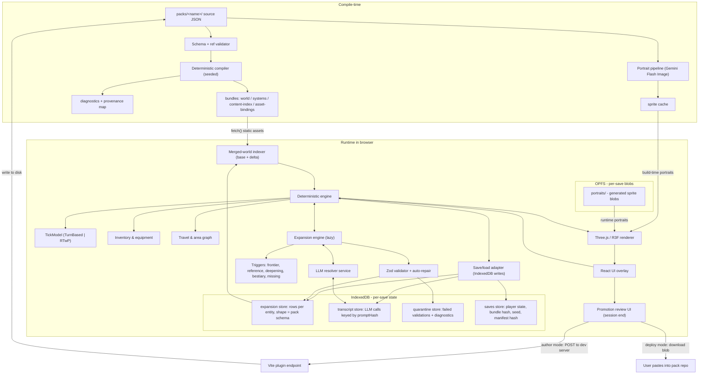
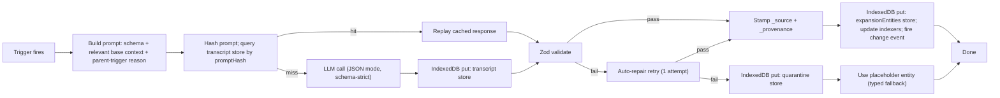

# Voyage 3D Engine — MVP Plan

## What we have today

[config.json](config.json) is a 9,531-line world spec consumed by Voyage's text-AI runtime. Useful for a 3D engine: 114 `locations` with `x/y` coords and an `areas` graph (each area has `paths` to neighbours), 12 `regions`, 12 `realms`, 121 `items` with `slot`/`category`/`bonuses`, abilities with `cooldown` + bonuses, traits with attribute/skill/resource modifiers, 12 `damageTypes`, 5 resources (health/stamina/mana/reservoir/willpower), **152 `npcTypes`** entries (bestiary with `vulnerabilities`/`resistances`/`immunities`, including common animals, wartide creatures, and named bosses like "Witch Queen"), 21 `encounterElements` (categorical hint strings for AI scene flavour, e.g. `"Inhabited Places"` -> `"- camps and outposts\n- villages and hamlets..."`), plus `aiInstructions`, `narratorStyle`, `worldBackground`.

Gaps that block an MVP:

- `quests` is `null` in the config
- `triggers` is `null` in the config
- No portraits/sprites for NPCs or items
- No tile/biome tag on locations to drive scene props
- `npcTypes` entries don't carry an explicit silhouette/size class (humanoid vs beast vs mass) — needs to be added or inferred

There is **no engine code** in the repo today — only authoring tooling (`.claude/`, `tabs/`, `lore/`).

## Decisions locked in

- **Visuals**: 3D scenes with 2D AI-generated portrait billboards (Wildermyth / Disco Elysium feel). No mesh generation.
- **AI runtime role**: hybrid resolver. Deterministic engine owns combat math, cooldowns, inventory, transitions. LLM owns narration, dialogue, ambiguous skill/social resolution (via structured tool calls), and runtime content expansion.
- **Scope**: vertical slice — 1 city (Avenor), 1 dungeon, ~5 NPCs, 1 quest, 1 combat, 1 dialogue tree. Every system generic and JSON-driven.
- **World expansion model**: per-save expansion delta layered on the base pack. Each save grows its own world. Same Zod schema validates expansion entries as base entries.
- **Expansion posture**: lazy. The scheduler triggers on encounter (frontier proximity, undefined reference, NPC interaction with a sketchy spec, missing-creature-for-this-biome), not in the background. Cost-conservative; future phases can add proactive triggers without rearchitecting.
- **Promotion-to-base is MVP-scope**: at session end, the author can review newly-generated entities and promote selected ones into `packs/hedoria/` via the existing `.claude/` candidate flow. The world learns over time.

## Engine principles (carried in from the long-term roadmap, plus expansion model)

These are non-negotiable from the start. Cheap to honour now, expensive to retrofit. Pulled from [`.cursor/plans/voyage_3d_mvp_roadmap_d89922aa.plan.md`](.cursor/plans/voyage_3d_mvp_roadmap_d89922aa.plan.md).

- **Pack, not world.** Hedoria lives under `packs/hedoria/`. The engine never hardcodes a world. A second minimal pack (`packs/tinyworld/`) is authored in parallel and runs through every code path in CI.
- **Base + delta.** The base pack is read-only at runtime. Each save carries an expansion delta with the same shape as the base pack, **stored in IndexedDB** under the save's namespace. Engine indexers merge base and delta into one logical world. The runtime never mutates files on disk.
- **Compiler runs in Node, runtime runs in the browser.** Source JSON is read only by the compiler (Node). The compiler emits hashed `bundles/*.json` to disk; those bundles are served as static assets and `fetch()`ed by the browser at app load. The browser never reads or writes files directly. All per-save mutation is IndexedDB; large blobs (portraits) go to OPFS. The same Zod schemas the compiler uses are reused at runtime to validate AI-generated expansion entries before they land in IndexedDB.
- **Schema gates everything.** Expansion entities (AI-generated NPCs, npcTypes, regions, locations, factions, items) validate against the same Zod schema as base entities. Failed validation → one auto-repair retry, then quarantine. Engine never accepts malformed data, ever.
- **Replay-determinism via transcript caching.** Every LLM call is recorded to the IndexedDB `transcript` store, keyed by a content hash of its prompt. Reloads replay from that store: same save = same world, no new LLM calls for already-generated entities.
- **Deterministic-by-construction (within a save).** Same pack + seed + same recorded transcript = byte-identical replay. One shared seeded RNG; no `Math.random()` in engine code.
- **Provenance on every entity.** Every entity carries `_source: "base" | "expansion"` and expansion entries also carry `_provenance: { generatedAt, model, promptHash, parentTrigger }`. Required for replay, debugging, and the promotion flow.
- **Tick model is data, not code.** Combat is a `TickModel` interface. MVP ships `TurnBased`; `RealTimeWithPause` (BG2 classic) is a future swap, not a rewrite.
- **Mandatory fallbacks.** Every binding (silhouette, biome, prop, portrait, animation tint) has a default. Builds never crash on missing assets — and lazy expansion never blocks rendering: a placeholder shows while generation runs.
- **Provenance in diagnostics.** Validation errors point at source-file path and key (or expansion trigger), not at compiler internals. e.g. `npcs.Sephilia.faction = "Royal Line" — no faction with this id (defined in tabs/npcs.json)`.
- **No world names in engine code.** Precommit lint forbids `Avenor`, `Hedoria`, `Sephilia`, `Quelled`, `Brotherhood`, etc. outside `packs/hedoria/`.

## Architecture



## Tech stack

- **3D**: [Three.js](https://threejs.org) via [react-three-fiber](https://docs.pmnd.rs/react-three-fiber). Sprites via `THREE.Sprite` for billboards, primitives + InstancedMesh for buildings/props.
- **UI**: React + TypeScript + Vite. [Zustand](https://github.com/pmndrs/zustand) for state, [XState](https://stately.ai) for the combat/dialogue state machines.
- **Validation**: [Zod](https://zod.dev) schemas mirroring the JSON shape, generated/maintained alongside the existing `.claude/skills/*/SKILL.md` docs.
- **LLM**: provider-agnostic adapter; default to **Gemini 2.5 Flash** for text (cheap + strong JSON), **Gemini 2.5 Flash Image** for portraits. Pluggable for Claude Haiku / gpt-4.1-mini. User brings own API key, stored in IndexedDB.
- **Persistence**: [Dexie](https://dexie.org) wrapper around IndexedDB for save state, expansion delta, transcript cache, and quarantine; **OPFS** (Origin Private File System) for portrait sprite blobs; `navigator.storage.persist()` requested on first save to avoid eviction.

## File layout (new code)

```text
packs/
  hedoria/         # source JSON; mirror of current tabs/ + manifest.json (schemaVersion, engineCompatibility)
  tinyworld/       # synthetic minimal pack; runs in CI alongside hedoria

engine/
  compiler/        # validator, normalizer, deterministic compiler -> bundles + diagnostics + provenance
  src/
    schema/        # Zod schemas; defines the pack contract; same schemas validate base AND expansion entries
    bundles/       # bundle types + loader (runtime reads bundles, never source JSON)
    world/         # merged-world indexer: takes base bundle + per-save expansion delta, produces unified views
    rules/
      tick/        # TickModel interface; TurnBased impl; RTwP placeholder
      combat/      # damage type matrix, abilities, resources
    inventory/
    travel/        # area graph traversal, world map travel
    state/         # Zustand store, save/load, RNG
    rng/           # single seeded RNG, derivable child seeds per system
    llm/           # adapter, prompts, tool definitions, caching, fallbacks
    expansion/
      triggers/    # frontier, reference, deepening, bestiary-growth, missing-entity
      generator/   # prompt builders per entity type (npc, npcType, region, location, faction)
      validator/   # Zod parse + auto-repair retry + quarantine
      integrator/  # write to per-save delta, update indexers, fire change events
    persist/       # IndexedDB + OPFS adapters: saves, expansionEntities, transcript, quarantine, portraits stores
    transcript/    # transcript-store wrapper: hash-key lookups, replay-mode override
    promotion/     # session-end review UI + dual writer (dev-server endpoint OR download-blob)
    render/
      scene/       # location -> 3D scene generation (deterministic from seed + bundle)
      sprites/     # billboard pipeline, portrait cache
      worldmap/    # region/location 2D overlay
      fallbacks/   # default silhouettes, biomes, props, placeholder portraits
    ui/            # combat HUD, dialogue panel, inventory, travel map, promotion review
    content-gen/   # build-time portrait/sprite gen scripts
  scripts/
    lint-no-world-names.mjs
  public/
  index.html

```

Source pack JSON (under `packs/`) is read-only at runtime. Only the `engine/compiler/` (Node) reads it; the runtime consumes the compiled bundles plus the per-save expansion delta from IndexedDB. Promotion is the only path that writes back to `packs/`, and it goes through the existing `.claude/` candidate review flow.

### Runtime persistence (browser-side)

The browser cannot mutate files on disk. All per-save mutation lives in **IndexedDB** (structured rows, transactional, GB-scale capacity per origin) and **OPFS** (Origin Private File System, for binary blobs). One database per app, namespaced by `saveId`.

**IndexedDB schema (object stores):**

- `meta` — singletons: app version, currently-active saveId, user settings (LLM key, expansion budget, etc.). Key: string.
- `saves` — one row per save. Fields: `saveId`, `packId`, `bundleHash`, `manifestHash`, `seed`, `playerState`, `createdAt`, `updatedAt`. Key: `saveId`.
- `expansionEntities` — every AI-generated entity. Fields: `saveId`, `entityType` (`"npc" | "npcType" | "region" | "location" | "faction" | "item"`), `entityId`, `data` (JSON conforming to the pack schema), `_source: "expansion"`, `_provenance`. Compound key: `[saveId, entityType, entityId]`. Index on `[saveId, entityType]`. Same shape as base entries; the indexer treats them identically once loaded.
- `transcript` — every LLM call. Fields: `saveId`, `callId`, `promptHash`, `model`, `prompt`, `response`, `tokens`, `generatedAt`. Compound key: `[saveId, callId]`. Index on `[saveId, promptHash]` for cache lookups.
- `quarantine` — validation failures. Fields: `saveId`, `quarantineId`, `entityType`, `attemptedData`, `diagnostics`, `failedAt`. Compound key: `[saveId, quarantineId]`. Visible in promotion review for manual repair or purge.

**OPFS layout (binary blobs only):**

```text
opfs/
  saves/<saveId>/portraits/<entityId>.png    # generated portrait sprite
  app/baseSprites/<assetId>.png              # baked-at-build-time sprite cache (mirrored from /public for offline play, populated lazily)
```

OPFS is used instead of IndexedDB Blob columns because hundreds of portrait Blobs in IndexedDB have well-known performance issues; OPFS gives us file-handle access with much better throughput. Saves remain self-contained — copying `idb:<saveId>` rows + `opfs:saves/<saveId>/` reproduces the run.

### Runtime modes

The engine runs in three deployment shapes. The MVP implements **author mode** first; the other two require no code changes.

- **Author mode** (default; for working inside a pack repo). Vite dev server runs alongside `packs/hedoria/`. The compiler runs in Node as a Vite plugin and re-emits bundles when source files change. The browser fetches bundles from the dev server, plays normally, persists to IndexedDB. The promotion UI POSTs approved entries to a `/__promote` endpoint exposed by the Vite plugin, which writes them to `packs/hedoria/candidates/<entityType>.json`. From there the existing [`.claude/` candidate review and `merge-candidates.js`](design/PRINCIPLES.md) flow takes over — the engine never writes to `tabs/` directly.
- **Deploy mode** (a hosted static-site instance with a frozen pack). Compiler ran at CI build time; bundles are baked into the static asset bundle. Browser fetches bundles from CDN, plays normally, persists to IndexedDB and OPFS. Promotion downloads a JSON file the user can manually drop into a pack repo. No backend.
- **In-browser compiler mode** (future). User drops a pack zip onto the page; the compiler — same Node-free TypeScript code — runs in a Web Worker; everything else identical. Out of MVP scope but architecturally trivial because the compiler is already pure code with no Node-specific deps beyond reads (`fs.readFile` is the only abstraction; we'll wrap it from day one).

## Engine subsystems

### Merged-world indexer

At app load: `fetch()` the compiled bundles (read-only, served as static assets); open the IndexedDB database and read all `expansionEntities` rows for the active save. Merge by `entityType`:

- Base entries (from bundles) and expansion rows (from IndexedDB) live in the same `Map<id, Entity>` keyed by entity id. Conflicts (same id in both) cannot occur in MVP — expansion only ever adds new ids.
- Build derived indexes over the merged set:
  - `npcsByLocation: Map<locationName, NPC[]>` from `npc.currentLocation`
  - `npcsByArea: Map<"loc/area", NPC[]>`
  - `areaGraph: Map<locationName, Graph<areaName>>` from each location's `areas[].paths`
  - `factionsById`, `traitsById`, `abilitiesById`, `itemsById`
  - `regionsByXY` for the world map
- Subscribe to expansion-engine change events; rebuild affected indexes incrementally when a new entity lands. The renderer subscribes to indexer change events too — new NPCs appear in scenes within a frame.

### Combat engine

Drives a turn-based encounter purely from the merged-world view. Reuses fields already in the pack:

- `attributeSettings.attributeNames` (6 stats)
- `resourceSettings.{health,stamina,mana,reservoir,willpower}` with `initialValue`/`maxValue`/`rechargeRate`
- `combatSettings.damageTypes` (12)
- `abilities[*].cooldown` and `bonus`
- `npcTypes[*]` for `vulnerabilities` / `resistances` / `immunities` (the bestiary; `npcs[*].type` is the foreign key in)
- `encounterElements.*` as **prompt-only context** (loose categorical strings like "Inhabited Places", fed to the LLM when populating empty areas — not stat data)
- `traits[*].attributes/skills/resources/abilities`

Deterministic core:

```ts
type CombatTick = (state: Encounter, action: Action) => Encounter;
```

Initiative = d20 + dex modifier. Hit = d20 + skill rank + ability bonus vs. AC derived from armor items + dex. Damage rolled, vulnerability/resistance/immunity from `npcTypes` applied. Cooldowns ticked.

**NPCs in the actual pack carry only `tier`/`level`/`hpMax`** — no `attributes`, no `skills` block. The combat engine fills the gaps by reading `combatSettings.tierDefaults` (or, if absent, the engine's hardcoded fallback table for the four observed tiers `trivial`/`strong`/`elite`/`boss`). Pack authors can override per tier without code changes.

**Inline-vs-reference abilities.** Many existing NPCs have `abilities` authored as **prose strings** (e.g. Brenna Halt's `"Forager's Eye: Identifies wild plants..."`) rather than references to the `abilities` block. The engine accepts both:

- String matches a key in the `abilities` block → full ability with `cooldown`/`bonus`, mechanical effect.
- String does not match any key → treated as an inline narrative ability. LLM-narrated only, no engine effect, no cooldown. Safe fallback.

This matches the actual data shape today and keeps the engine forward-compatible with the cleanup pass already noted in the repo's `TODO.md`.

The LLM is asked to **describe** the resolved tick, not to compute it — except for "social/skill checks" where the engine emits a `RequestResolution` event and the LLM returns `{ outcome: "success" | "fail" | "partial", narration: string, side_effects: ToolCall[] }`.

### Death and recovery

`death.permadeath: false` is canonical for this pack. On combat-defeat the engine runs the recovery sequence defined in `death.instructions`:

1. Engine flags the encounter as lost; freezes turn order.
2. LLM is invoked with `death.instructions` as the system prompt + the lost-encounter context. **This prompt contains mature content** (the canonical post-defeat narrative for this world is sexual-assault-then-magical-teleport-to-safety); the provider adapter must use a model that won't refuse. See risk note.
3. Engine applies mechanical consequences: restore player to full health, possibly drop a fraction of inventory + currency (configurable via pack), set a "recently broken" debuff that decays over a few in-world days, transport the player to the nearest `known: true` `location`.
4. Save state writes a `deathEvents` row recording what happened, for narrative continuity in later scenes.

Engine-side this is one state machine: `Combat → Defeat → Recovery → Aftermath → Idle`. Pack authors can swap the prose by editing `death.instructions`; the mechanical effects are pack-configurable too via `death.consequences?` (currency loss bounds, item-loss probability, debuff duration). MVP ships sensible defaults if those fields are absent.

### Dialogue system

NPC clicked -> open dialogue panel. Each turn:

1. Engine builds a compact context window: NPC card (name, type, faction, personality, abilities, hiddenInfo), current player state, recent transcript, `narratorStyle`, region/location summary.
2. Player input goes to the LLM with a fixed tool set:

```ts
type DialogueTool =
  | { name: "say"; args: { text: string } }
  | { name: "offer_quest"; args: { questId: string } }
  | { name: "accept_quest"; args: { questId: string } }
  | { name: "update_quest_progress"; args: { questId: string; note: string } }
  | { name: "complete_quest"; args: { questId: string; evidence: string } }
  | { name: "fail_quest"; args: { questId: string; reason: string } }
  | { name: "give_item"; args: { itemId: string; qty: number } }
  | {
      name: "give_currency";
      args: { gold?: number; silver?: number; copper?: number };
    }
  | {
      name: "request_skill_check";
      args: { skill: string; difficulty: number; stake: string };
    }
  | { name: "attack"; args: { reason: string } }
  | { name: "end_dialogue"; args: { mood: string } };
```

3. Engine applies tool effects deterministically; the LLM only narrates. `complete_quest` runs a separate verification prompt against the quest's `completionCondition` before flipping status (see Quests in Schema additions).

### Runtime world expansion

The world definition grows during play. The base pack stays read-only; each save accumulates its own delta in **IndexedDB** (the `expansionEntities` store). Lazy posture: nothing runs in the background; expansion fires on encounter, blocking briefly with a placeholder while it resolves (~1-3 seconds at Gemini Flash). No file mutation ever happens at runtime — the only writes are IndexedDB transactions and OPFS blob writes for portraits.

**Triggers (data-driven, registered, easy to add later):**

- **Frontier** — player approaches an undefined region neighbour (location's `region` doesn't exist yet, or world map edge has no defined region beyond it). Generates 1 region, then 1-3 locations within it.
- **Reference** — engine resolves a foreign key (NPC's `faction`, location's `region`, quest's `giver`) and finds the target missing. Generates the missing entity. Capped depth-2 to prevent infinite reference chains.
- **Deepening** — an NPC the player interacted with has a sketchy spec (only `name` + `type`, no `personality`, no `abilities`, no `hiddenInfo`). One LLM call adds the missing fields. Cached so it never runs twice for the same NPC.
- **Bestiary growth** — an encounter trigger needs a creature for this biome and no existing `npcTypes` entry fits. Generates a new `npcTypes` entry (with `vulnerabilities`/`resistances`/`immunities`) tagged to the biome.
- **Missing entity in dialogue** — LLM dialogue tool-call references an item or NPC that doesn't exist (e.g. "the captain mentions her sister Renya"). Engine intercepts, generates the entity, retries the tool-call.

**Generation pipeline per trigger:**



**Prompt construction:**

- System: `worldBackground` + `narratorStyle` + the relevant `aiInstructions.generate*` block + the Zod-derived JSON schema for the target entity type (e.g. `aiInstructions.generateNewNPC` + npc schema).
- User context: 3-5 nearby/related entities from the merged world (e.g. for a new NPC: the location, its region, its dominant factions, sibling NPCs already in the area).
- Output: strict JSON, schema-validated.

**Expansion never produces a foreign-key dangling entity.** If the LLM proposes `faction: "Whisperers of the Spire"` and no such faction exists, the integrator re-fires Reference trigger to generate it before the parent NPC is integrated. Cycle-safe via the depth-2 cap and a per-trigger lock.

**Name filter is enforced post-generation.** The pack's `nameFilterSettings` carries 13 first-name replacement tables (currently filtering names like `Kaelen`, `Voss`, `Marcus`, `Mira`, `Elara`, `Pip`, `Kira`, `Malik`, `Serra`, `Thorne`, plus a handful of Earth-flavoured surnames). When the LLM emits an entity with a banned first name in the `name` field, the integrator swaps it for a deterministic pick from the table (seeded by `promptHash`, so replays land on the same replacement). This is the engine-side enforcement of the user feedback already captured in [feedback.md](feedback.md).

**Cost discipline (lazy posture):**

- Hard cap: max one expansion call in flight at a time (no parallelism in MVP).
- Per-session token budget surfaced in the UI; user can pause expansion entirely.
- All cached forever in the IndexedDB `transcript` store; replays are free.

**Quarantine:** validation failures land as rows in the `quarantine` IndexedDB store with the attempted JSON, the trigger that created them, and Zod diagnostics. Visible in the promotion review UI for manual repair, edit-and-promote, or purge.

### Promotion to base pack

The world learns over time, but only with author consent. At session end (or via a panel command), the user gets a review UI that reads from the `expansionEntities` and `quarantine` IndexedDB stores:

- **Per-entity preview**: the AI-generated NPC/region/location/etc. with its `_provenance` info (which trigger created it, when, off which prompt) and a diff against the base pack.
- **Actions**: approve / edit / reject. Approved entries are written to `packs/<pack>/candidates/<entityType>.json` — the same staging area the existing `.claude/` agents write to. They go through the existing `merge-candidates.js` flow before landing in `tabs/` (per [design/PRINCIPLES.md](design/PRINCIPLES.md): "No agent writes to `tabs/` directly").
- **Bulk operations**: approve-all-by-trigger ("approve all the deepening entries for NPCs I talked to"), reject-all-quarantined.
- **Edit-in-place**: minor field tweaks before promotion (rename, reword `hiddenInfo`, fix a faction reference). Saved as if the AI had produced the edited version.

**Two writeback impls behind one interface** (the engine never assumes file access from the browser):

```ts
interface PromotionWriter {
  writeCandidates(packId: string, entries: PromotionEntry[]): Promise<void>;
}
```

- `DevServerWriter` (author mode): `POST /__promote` to the Vite dev plugin endpoint; the Node side writes `packs/<packId>/candidates/<entityType>.json`.
- `DownloadBlobWriter` (deploy mode): bundles the approved entries into a single zipped JSON the browser downloads via `URL.createObjectURL`. The user manually drops it into a pack repo's `candidates/` directory.

The UI is identical in both modes; only the writer differs.

Promoted entries become base content on the next compile; they are removed from the save's `expansionEntities` rows on a successful promotion (no double-counting).

**This is the intended growth loop:** play → AI invents content (validated, in IndexedDB) → author reviews → world canon expands → next play session starts richer.

## 3D rendering

### World map

Render a 2D Three.js orthographic overlay built from `regions[*].{x,y}` and `locations[*].{x,y,radius}`. Click a location to load its scene. Region polygons are inferred from nearest-region per location (Voronoi over the region centroids).

### Location scenes

Each location becomes a small 3D scene built procedurally:

- Floor plane sized from `radius`; ground material picked from a small biome palette derived from `region.basicInfo` keywords (river/desert/forest/mountain/marble) — this is the one place we cheat with a few hand-tuned style tags.
- Each `area` in the location is rendered as a "room" arranged on a circle around the floor centre. Connecting `paths` become floor strips between rooms (graph layout via a simple force-directed layout pre-baked at load).
- Walls/buildings are extruded primitives parametrised by `complexityType` and `detailType` already on each location.
- Props (banners, market stalls, throne, altar) are picked from a tiny tag library matched against `area.description` keywords.

### Billboard NPCs and items

- Each NPC gets one `THREE.Sprite` with an AI-generated 256x256 portrait (Gemini Flash Image, prompted from `visualDescription` + species traits + faction colors). Idle/talk/hit are tinted variants — no animation rigs.
- Equipment is rendered as a second sprite layer above the NPC (`mainHand`, `offHand`) using a small generic icon library colour-keyed by item rarity tier (`[Common]`/`[Uncommon]`/...).
- Player is shown as a sprite with the same pipeline.

### Camera

Fixed isometric tilt-shift camera per scene (BG2/Pillars feel) with click-to-move on the floor and click-to-target for combat. No free-cam in MVP.

## LLM integration

### Provider adapter

```ts
interface LLMProvider {
  complete(req: {
    system: string;
    messages: Msg[];
    tools?: ToolSpec[];
  }): Promise<LLMResp>;
  generateImage(prompt: string, ref?: ImageRef): Promise<Blob>;
}
```

Initial impl: `GeminiProvider` (Flash for text, Flash Image for portraits). Same surface fits Anthropic/OpenAI later.

### Prompts and caching

- System prompt = world canon: `worldBackground` + `narratorStyle` + active region/location summary + the relevant `aiInstructions.generate*` block for the current operation. Static per scene -> qualifies for prompt caching on Gemini/Anthropic, ~10x cost reduction.
- The pack's `aiInstructions` block is reused directly — no reinvention. Mapping:
  - Opening scene → `aiInstructions.generateInitialStart` (already structured: Opening Structure / Style Principles / custom)
  - Dialogue / narration tick → `aiInstructions.generateDMResponse` + `aiInstructions.generateStory.custom`
  - New NPC during expansion → `aiInstructions.generateNewNPC`
  - NPC deepening → `aiInstructions.generateNPCDetails` + `aiInstructions.generateNPCIntents`
  - New location during expansion → `aiInstructions.generateLocationDetails`
  - New region → `aiInstructions.generateRegionDetails`
  - Encounter spin-up → `aiInstructions.generateEncounters`
  - Item spawn → `aiInstructions.ItemGenerationAndUsage`
  - Resource updates after a beat → `aiInstructions.generateResourceUpdates`
  - Faction queries → `aiInstructions.generateFactionDetails`
  - Action arbitration → `aiInstructions.generateActionInfo`
- Per-turn message = compact diff (last 6 turns + active NPC card + last action).
- Streaming for narration; non-streaming with strict JSON schema for tool calls.

### Cost discipline

- Portraits generated lazily on first encounter, cached forever.
- One LLM call per dialogue turn, one per skill check, one per area-expansion event. No per-frame calls.
- Compact transcripts via rolling summary every 10 turns.

Rough budget at Gemini 2.5 Flash pricing: ~$0.001-$0.005 per dialogue turn, ~$0.01-$0.04 per portrait. A 30-minute MVP playthrough should fit under $0.30.

## Schema additions

Small, non-breaking additions to the pack JSON, all optional with safe defaults:

- **`manifest.json`** at pack root: `{ packId, packName, schemaVersion, engineCompatibility, seed }`. Required for every pack. Migration tooling lands when the first schema version bumps.
- **`_source`** on every entity: `"base" | "expansion"`. Base entries default to `"base"` if absent; the compiler stamps base on bundle output. Expansion entries always carry `"expansion"`.
- **`_provenance`** on expansion entities only: `{ generatedAt: ISO8601, model: string, promptHash: string, parentTrigger: { kind: "frontier"|"reference"|"deepening"|"bestiary"|"missing-entity", originId: string } }`. Required for replay, debugging, and the promotion flow.
- `locations[*].sceneTags?: string[]` — biome/style hints for prop picking. Fall back to keyword scan of `region.basicInfo`.
- `locations[*].areas[*].spawn?: Array<{ ref: string; chance: number }>` — optional encounter slots. Engine falls back to runtime LLM expansion when absent.
- `npcs[*].portrait?: string` — sprite URL. Generated and back-filled by the portrait pipeline.
- `npcTypes[*].silhouette?: "humanoid" | "beast" | "mass" | "construct"` — drives sprite frame size for the 152 existing entries. Fall back to a heuristic over `description` keywords (e.g. `[Tier 1] [Common] Massive bovine` -> `beast`).
- `npcTypes[*].biomes?: string[]` — which biomes this creature can be summoned into by the bestiary-growth trigger. Optional; the trigger filters the bestiary by biome match before deciding it needs to invent a new type.
- `combatSettings.tickModel?: "turn-based" | "rtwp"` — defaults to `"turn-based"` for MVP. Engine reads this and instantiates the matching `TickModel`.
- **`combatSettings.tierDefaults?`** — tier → default stat block table. Required because actual NPCs in the pack have only `tier`/`level`/`hpMax` (no `attributes`/`skills` blocks), so combat math has nothing to roll against without defaults. Observed tiers: `trivial`, `strong`, `elite`, `boss`. Shape:

```ts
type TierDefaults = {
  attributes: Record<
    | "strength"
    | "dexterity"
    | "constitution"
    | "intelligence"
    | "wisdom"
    | "charisma",
    number
  >;
  skillRank: number; // applied to all utility skills if NPC has no explicit skill block
  ac: number; // armor class
  attacksPerTurn: number;
  damageDie: string; // e.g. "1d8+2"
};
type CombatSettings = { tierDefaults?: Record<string, TierDefaults> };
```

If `tierDefaults` is absent, the engine ships hardcoded fallbacks (`trivial`/`strong`/`elite`/`boss` defined in `rules/combat/tierFallbacks.ts`) so the build never crashes. Pack-level overrides are the right path for tuning.

### Quests — the existing schema (no change needed)

The quests block is **prose-driven**, not state-machine. The 4 existing quests confirm the shape:

```ts
type Quest = {
  name: string; // id (e.g. "the-apothecarys-basket")
  questSource: string; // narrative attribution (often the giver's name)
  questStatement: string; // the player-facing pitch
  mainObjective: string; // one-sentence goal
  completionCondition: string; // prose; the LLM judges satisfaction against this
  questDesignBrief: string; // longer prose blob with rewards, NPCs, design intent
  detailType: "basic" | "detailed";
  questLocation: string | null; // location id; nullable
  questGiverNPC: string; // NPC id
};
```

There is no structured `steps`, `triggers`, or `rewards`. Engine state per quest is small:

```ts
type QuestState = {
  questId: string;
  status: "available" | "active" | "completed" | "failed" | "abandoned";
  acceptedAt?: number; // turn index
  completedAt?: number;
  progressNotes: string; // free-form, LLM-updated each relevant beat
  completionEvidence?: string; // the final fact the LLM cited when marking complete
};
```

The dialogue/narration tool set gains:

```ts
| { name: "offer_quest"; args: { questId: string } }
| { name: "accept_quest"; args: { questId: string } }
| { name: "update_quest_progress"; args: { questId: string; note: string } }
| { name: "complete_quest"; args: { questId: string; evidence: string } }
| { name: "fail_quest"; args: { questId: string; reason: string } }
| { name: "give_currency"; args: { gold: number; silver: number; copper: number } }
```

Completion verification: when the LLM calls `complete_quest`, the engine fires a separate validation prompt (small, cheap) — "given this `completionCondition` and this `completionEvidence`, is the quest actually complete? Reply with strict yes/no JSON" — to guard against drift. Conservative bias toward no. Player can manually mark complete via UI escape hatch if they're confident the LLM is being too strict.

The `triggers` block is `null` in the pack and stays unused for MVP. Procedural quest progression is fully via dialogue + narration tool calls.

## Vertical slice content

The 4 existing quests centre on Red Harvest in Avenor and form a natural starting hub. We do not need to author a new quest:

- `the-apothecarys-basket` (Brenna Halt) — courier across the Avenor road, dialogue + travel
- `the-cellar-vermin` (Goran of the Three Wagons) — combat against bestiary `Gristlemaws`
- `the-road-marker-bundle` (Old Mirek) — short retrieval, mystery hook
- `the-avenor-run` (Saska Vorin) — escort with combat encounters

The referenced NPCs (Brenna Halt, Goran of the Three Wagons, Old Mirek, Saska Vorin) already exist in `tabs/npcs.json`. The `gristlemaw` `npcType` already exists in the bestiary with `vulnerabilities`/`resistances`/`immunities`. Red Harvest exists as a location with one area today.

To run the vertical slice end-to-end we only need to author:

- **1 dungeon-style location** in `tabs/locations.json` (Goran's cellar, with 2-3 areas connected by paths) — required because `the-cellar-vermin` quest needs a combat scene that isn't just Red Harvest's main area
- **Areas added to Red Harvest** (currently has none defined) — to give the player something to walk around in the starting hub. 3-4 areas: tavern common room, stable yard, market street, the apothecary's stoop. Required because Phase 4 (procedural scenes) needs an area graph to render.

Per the project rules, the authoring goes through `.claude/` agents and the `candidates/` -> `merge-candidates.js` flow, not direct edits. Phase 10 is now ~1 day of authoring instead of 3-5.

## Phased roadmap

- **Phase 0 — Skeleton (1-2 days).** Vite + R3F project, Zod schemas, pack contract (`manifest.json`, `schemaVersion`), validator that reads `packs/hedoria/`, seeded RNG primitive.
- **Phase 0.5 — Genericity guards (1 day, parallel).** Author `packs/tinyworld/` (~50 lines), add `lint-no-world-names.mjs` precommit, wire CI to compile both packs.
- **Phase 1 — Compiler stage (2-3 days).** Validator + normalizer + deterministic compiler emitting bundles + diagnostics with source-file provenance. Same Zod schemas exported for runtime expansion validation. Bundle hash recorded into the save's `bundleHash` field. **Two modes: `--soft` (warnings, builds anyway, populates `bundles/_diagnostics.json`) for first-pass dev work; `--strict` (errors, blocks build) for CI.** First compile of `packs/hedoria/` will hit existing FK gaps (e.g. NPC `Sephilia.faction = "Royal Line"` references no defined faction id); soft mode lets us iterate while those are cleaned up via the existing TODO. Compiler also auto-extracts observed enum values per field (e.g. `detailType ∈ {"basic","detailed"}`, `tier ∈ {"trivial","strong","elite","boss"}`) and warns on first-seen new values rather than failing.
- **Phase 1.5 — Persistence layer (1-2 days).** IndexedDB wrapper (Dexie) with object stores (`meta`, `saves`, `expansionEntities`, `transcript`, `quarantine`); OPFS adapter for portraits with IndexedDB-Blob fallback; `navigator.storage.persist()` request flow on first save; quota monitoring + warnings. Empty stores work the same as no save — every later phase plugs in here.
- **Phase 2 — Merged-world indexer (1-2 days).** Indexer takes base bundles (from `fetch()`) + `expansionEntities` rows (from IndexedDB) and produces unified views (`npcsByLocation`, `areaGraph`, etc.). Subscribes to delta change events; rebuilds incrementally. Empty delta works the same as no delta. This unblocks every later phase that wants to add expansion.
- **Phase 3 — World map (2-3 days).** Region/location overlay from indexer, click-to-enter, basic camera, no NPCs.
- **Phase 4 — Scenes (3-5 days).** Procedural location scenes from `areas` (deterministic from seed), area-graph navigation, props from biome tags, fallback table for unknown biomes/props.
- **Phase 5 — Sprites (2-3 days).** Portrait pipeline, NPCs visible in scenes, equipment overlay sprites, placeholder fallback portraits for unknown NPCs.
- **Phase 6 — Combat core (4-6 days).** `TickModel` interface; `TurnBased` implementation wired to `abilities` / `resources` / `damageTypes` / `npcTypes`. UI HUD. No LLM.
- **Phase 7 — LLM resolver (3-5 days).** Provider adapter, transcript-cached client, dialogue panel with tool-calls, narration overlay on combat ticks, skill-check resolution.
- **Phase 8 — Lazy world expansion (4-6 days).** Trigger registry (frontier, reference, deepening, bestiary, missing-entity), per-entity-type generators with prompt builders, Zod validator + auto-repair retry + quarantine writes, integrator that puts validated entities into `expansionEntities` (IndexedDB) and fires indexer change events. Hooked into encounter, dialogue, and travel events. Transcript-cached LLM client built on top of the persistence layer.
- **Phase 9 — Promotion flow (2-3 days).** Session-end review UI listing expansion entities by trigger; reads `expansionEntities` and `quarantine` from IndexedDB. Approve/edit/reject. Two `PromotionWriter` impls: `DevServerWriter` (POSTs to `/__promote` on the Vite plugin) and `DownloadBlobWriter`. Approved entries are written to `packs/hedoria/candidates/` via the dev plugin in author mode, or downloaded as JSON in deploy mode.
- **Phase 10 — Vertical slice content (~1 day, parallelisable).** Author Goran's cellar location + add areas to Red Harvest. The 4 existing quests, 4 quest-giver NPCs, and the `gristlemaw` bestiary entry are already in the pack — no new quests or bestiary needed.

Total: ~4-5 weeks of focused engineering for a playable vertical slice with the world-grows-during-play loop end-to-end. Persistence layer (Phase 1.5) is the only architecturally critical addition from the file-vs-IndexedDB clarification — once it lands, every later phase reads and writes through that layer, never directly to the filesystem.

## Implementability checks (state of the pack as of plan time)

All confirmed against the current `config.json` and `tabs/`:

- **Pack contents**: 12 realms, 12 regions, 114 locations (mostly with `x`/`y`/`radius`/`region`; some without an `areas` graph), 152 `npcTypes` (bestiary with `vulnerabilities`/`resistances`/`immunities`), 15 `npcs`, 121 `items` (with `slot`/`category`/`bonuses`), 21 `encounterElements` (prompt-only), abilities + traits + skills + 6 attributes + 5 resources + 12 damage types + character/location/region archetypes — all populated and consumable.
- **Quests**: 4 entries, prose-driven schema (`questStatement`/`mainObjective`/`completionCondition`/`questDesignBrief`/`questGiverNPC`/`questLocation`). All centred on Red Harvest in Avenor — natural starting hub. Plan now matches this shape.
- **Triggers**: still `null`. Plan does not depend on them.
- **NPC stat blocks**: thin (only `tier`/`level`/`hpMax`). Plan covers via `combatSettings.tierDefaults` with engine fallbacks.
- **NPC abilities**: mostly inline prose strings, not references. Plan covers via the inline-vs-reference handler.
- **NPC name/faction FKs**: known to have gaps (e.g. `Sephilia.faction = "Royal Line"` is dangling). Plan covers via compiler `--soft` mode.
- **`death.permadeath: false` + `death.instructions`**: rich prose. Plan covers via the Death and recovery subsystem.
- **`nameFilterSettings`**: 13 first-name replacement tables. Plan covers via expansion integrator post-processing.
- **`aiInstructions`** block: all sub-prompts present and used by Voyage today. Plan reuses verbatim per operation — no prompt reinvention.
- **`embeddingId` / `embeddings`**: Voyage's semantic-retrieval state. `embeddings` block is empty. Plan ignores both for MVP (FKs are by string id).
- **Vertical-slice authoring needed**: Goran's cellar location + areas added to Red Harvest. ~1 day. No new quests, NPCs, or bestiary needed.
- **No engine code exists in the repo today**: green-field implementation.

External risks the plan cannot eliminate, only mitigate:

- **Mature-content stance vs hosted models** (especially the `death.instructions` narrative): Gemini Flash, Claude Haiku, OpenAI all have safety filters that can refuse. Mitigation: provider-agnostic adapter, week-1 smoke test against Gemini Flash + Claude Haiku 4.5 + Llama-3.1-70B (Ollama). Pick the most permissive that supports JSON-mode tool calling. If all three fail, this is a real blocker that requires reframing the prose or accepting a self-hosted-only deploy.
- **Portrait-consistency drift across Flash Image calls**: real but bounded; reference-image-per-character + tinted variants is the published mitigation pattern. Expect occasional weirdness.
- **First playthrough cost**: with lazy expansion + transcript caching, replays are free; first plays at ~$0.10-$0.30 per 30-minute session. Hard cap surfaced in UI.

## Long-term direction (deferred but architecturally locked in now)

These are scope items from [the long-term roadmap](.cursor/plans/voyage_3d_mvp_roadmap_d89922aa.plan.md) plus expansion follow-ups we are not building in MVP, but the MVP architecture preserves the option to land them without rewrites:

- **Proactive background expansion scheduler.** Web Worker that fills out neighbouring regions and deepens NPCs ahead of the player. Same trigger registry as MVP; just a different invocation cadence. MVP keeps the registry data-driven so the swap is a config change.
- **Shared canon mode.** Multi-player or multi-save world where validated expansion accumulates into a shared definition. Requires conflict resolution. MVP's per-save delta + provenance stamps + promotion flow are the building blocks.
- **Smoke-simulation auto-playtest.** Headless playthrough that spawns a player, traverses a path, completes one quest. Engine must be runnable without a renderer (renderer subscribes to the engine, never the reverse). MVP: ensure the engine has no DOM/Three dependencies in `rules/`, `bundles/`, `world/`, `expansion/`, `state/`, `rng/`.
- **Migration tooling for schema bumps.** First migration ships the day we change the schema. The hardest case is migrating in-flight expansion deltas in long-running saves; document this risk now.
- **Quest-graph cycle detection.** Deferred until quests are non-trivial. Compiler structure leaves a slot for graph-shape validators.
- **Continuous regeneration pipeline (rebuild-on-content-change → publish).** Out of scope for MVP; CI building on push is sufficient.
- **Real-time-with-pause tick model.** `TickModel` interface is in place; `RTwP` is a future implementation that drops in without touching consumers.
- **Lint dashboards (unreachable quests, broken refs, balance anomalies, quarantine review).** Diagnostics infrastructure is built in Phase 1; dashboards are a future surface on top.

## Risks and trade-offs

- **Procedural-scene quality plateaus fast.** A small hand-tuned biome/prop library (still data-driven, but maintained) does most of the work. Without it, scenes feel samey.
- **Portrait consistency across calls.** Gemini Flash Image with a reference image per character (first generation cached as the reference for variants) keeps faces consistent enough for sprites; expect occasional drift.
- **Empty `quests`/`triggers` blocks** mean we cannot demo a "quest played from JSON" until at least one is authored. Phase 10 must run alongside engine work.
- **Mature content stance.** The world's tone (per [design/PRINCIPLES.md](design/PRINCIPLES.md)) includes adult themes that some hosted models will refuse to narrate. Provider adapter must support a model that won't 4xx on canon content (Gemini Flash is currently permissive enough; Claude Haiku is borderline; OpenAI is restrictive). Worth testing early — this is a blocker, not a polish item.
- **Generic engine claim.** "Works for any pack" only holds if (a) Tinyworld actually compiles and runs through CI from Phase 0.5 onward, and (b) the no-world-name lint blocks regression. Without those guards, Hedoria-isms drift in within a week.
- **Determinism drift.** Deterministic-by-construction (within a save, given the recorded transcript) is easy to assert and easy to violate (one stray `Date.now()` or `Math.random()` and replays diverge). Mitigation: lint rule banning `Math.random` in `engine/src/`; require all randomness to come from the seeded RNG; golden-bundle hash test in CI.
- **Lazy expansion latency.** First encounter with an undefined entity blocks ~1-3 seconds while the LLM generates. UX risk. Mitigation: show a typed placeholder immediately ("a stranger approaches") and swap in the generated entity when it arrives; the placeholder participates in dialogue with throwaway lines until the real spec lands.
- **Expansion budget runaway.** A single dialogue can chain Reference triggers (NPC mentions sister, sister mentions cousin, etc.). Mitigation: depth-2 cap, per-trigger lock, per-session token budget surfaced in UI, hard pause/resume control.
- **Foreign-key drift in expansion.** AI may produce `faction: "Some Faction"` that doesn't exist; the integrator catches this via Reference trigger but a malicious or sloppy LLM response could cycle. Mitigation: depth cap, max-expansion-per-encounter cap, fall back to nearest existing faction by string distance after the cap.
- **Schema drift across long-running saves.** A save started on `schemaVersion: 1.0` and played for 50 hours still validates against `1.0`. If `1.1` adds a required field, the in-flight `expansionEntities` rows are broken. Mitigation: only ever add optional fields in minor version bumps; a migration is required for any breaking change and must transform delta rows in IndexedDB on load (using the `versionchange` event of `IDBFactory.open`).
- **Quarantine bloat.** Repeated validation failures pile up in IndexedDB. Mitigation: surface row count in UI; promotion review includes a "purge quarantine" action; cap the store at e.g. 1000 rows with FIFO eviction.
- **Promotion review fatigue.** After a long session there could be dozens of expansion entries to review. Mitigation: bulk-approve-by-trigger, default-trust on deepening (low-risk additions to existing entities) vs. default-review on bestiary growth and new regions (high-impact).
- **Replay miss.** If a transcript row is missing or its `promptHash` changes, replay diverges silently. Mitigation: transcript writes are idempotent and content-addressed; load-time integrity check prints a warning and falls back to a live LLM call (which then re-records).
- **IndexedDB quota / browser eviction.** The browser may evict storage under pressure if the origin isn't marked persistent. Mitigation: call `navigator.storage.persist()` on first save, surface a warning if the user denies; quota check before every batch write; document that incognito mode loses saves on close.
- **OPFS isn't universally available yet.** Older Safari has incomplete OPFS. Mitigation: feature-detect; fall back to storing portrait Blobs in the `expansionEntities` rows (slower but works) when OPFS is missing.
