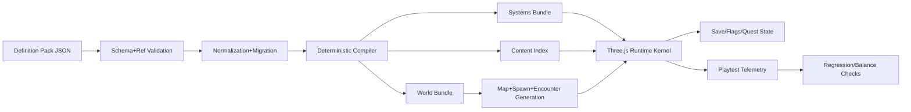

name: Generic RPG Build Engine Roadmap
overview: Build a generic Three.js-based game-building engine that ingests world definition packs (like `tabs/`) and deterministically outputs a playable 3D RPG every time content changes.
todos:

- id: definition-pack-spec
  content: Define a generic content pack contract (schema modules, IDs, references, versioning) independent of this specific world.
  status: pending
- id: deterministic-build-pipeline
  content: Implement deterministic compiler/generator pipeline from content pack to runtime game bundles.
  status: pending
- id: runtime-kernel
  content: Build reusable runtime kernel (rendering, nav, combat, quest, save systems) driven entirely by generated bundles.
  status: pending
- id: asset-binding-layer
  content: Create data-to-asset binding rules so definitions map to modular models, materials, animations, and VFX without hardcoding per world.
  status: pending
- id: continuous-regeneration
  content: Add automated rebuild, validation, and regression checks so any definition changes produce a fresh playable game build.
  status: pending
  isProject: false

---

# Generic 3D RPG Build Engine (BG2-like Runtime)

## Goal

- Build a **generic engine** that ingests definition packs shaped like [`/home/jorgen/repo/World-Puppeteer/tabs/realms.json`](/home/jorgen/repo/World-Puppeteer/tabs/realms.json), [`/home/jorgen/repo/World-Puppeteer/tabs/regions.json`](/home/jorgen/repo/World-Puppeteer/tabs/regions.json), [`/home/jorgen/repo/World-Puppeteer/tabs/locations.json`](/home/jorgen/repo/World-Puppeteer/tabs/locations.json), [`/home/jorgen/repo/World-Puppeteer/tabs/npcs.json`](/home/jorgen/repo/World-Puppeteer/tabs/npcs.json), [`/home/jorgen/repo/World-Puppeteer/tabs/items.json`](/home/jorgen/repo/World-Puppeteer/tabs/items.json), [`/home/jorgen/repo/World-Puppeteer/tabs/abilities.json`](/home/jorgen/repo/World-Puppeteer/tabs/abilities.json), and outputs a fresh playable 3D RPG whenever definitions change.
- Target runtime feel: **BG2-lite loop** (isometric exploration, tactical real-time/pause combat, quest progression, inventory, NPC interaction), but with world-agnostic generation.
- Treat this repository as the **reference pack**, not as hardcoded gameplay data.

## Non-Negotiable Product Constraints

- No world-specific logic in runtime systems (`if world == X` patterns are prohibited).
- Game outputs must be **deterministic for same input pack + seed + engine version**.
- Definition schema must be versioned and backward-compatible (with migration tooling).
- Build must fail fast on invalid references, missing required runtime parameters, and cyclic quest/trigger deadlocks.

## Target Architecture

## Engine Layers

### 1) Definition Pack Contract

- Split schema into composable modules: world topology, actor catalogs, gameplay rules, quests/triggers, asset bindings, generation policies.
- Require stable IDs, explicit foreign keys, and optional extension namespaces for future genres.
- Add `schemaVersion`, `engineCompatibility`, and migration scripts for older packs.

### 2) Deterministic Compiler/Generator

- Stage A: validate and normalize raw definitions.
- Stage B: compile into runtime bundles (`world`, `systems`, `content-index`, `asset-bindings`).
- Stage C: run seeded generation for terrain/layout/spawns/encounter tables.
- Stage D: emit diagnostics (`errors`, `warnings`, `auto-filled defaults`) plus provenance map for debugging.

### 3) Runtime Kernel (World-Agnostic)

- Rendering/camera/nav/input as reusable kernel.
- Systems loaded from data: combat, inventory, quests/triggers, dialogue, save flags.
- Tick model + pause model must be data-configurable per pack.

### 4) Asset Binding and Procedural Assembly

- Use archetype-driven mapping: `npcType -> baseMesh/material/animationSet`.
- Use biome/theme mapping: `region tags -> tile kit/foliage/props/lighting`.
- Keep generated scenes modular so pack swaps do not require manual re-authoring.

### 5) Continuous Regeneration Pipeline

- On content changes, automatically rebuild game bundles.
- Run smoke simulation: spawn player, traverse path, complete one generated quest chain.
- Publish a playable build artifact for each validated content revision.

## Phased Delivery Plan

### Phase 0: Generic Spec Baseline (1-2 weeks)

- Formalize cross-pack schema contract using current `tabs/` as seed examples.
- Define mandatory runtime fields (positioning, nav hints, stat blocks, quest graph nodes, trigger conditions/actions).
- Publish migration notes for existing packs.

### Phase 1: Compiler and Validation Core (2-3 weeks)

- Implement validator + normalizer + deterministic compiler.
- Emit minimal runnable bundles from any valid definition pack.
- Add snapshot tests to guarantee deterministic output for fixed seed.

### Phase 2: Runtime Kernel MVP (3-5 weeks)

- Build Three.js isometric client that consumes only generated bundles.
- Implement movement/pathing, combat primitives, inventory, quest/trigger FSM, save-state.
- Ensure no direct reads of authoring JSON at runtime (only compiled bundles).

### Phase 3: Procedural World and Content Assembly (2-4 weeks)

- Generate region/location zones from topology definitions plus generation policy.
- Bind NPC/item/ability catalogs into spawn tables and encounter templates.
- Build default dialogue/quest templates for packs that provide sparse narrative data.

### Phase 4: Regeneration, QA, and Author Tooling (2-3 weeks)

- Add “change definitions -> rebuild -> auto-playtest -> publish” pipeline.
- Add lint dashboards for schema quality, unreachable quests, broken references, balancing anomalies.
- Provide pack author feedback with exact source-path diagnostics.

## Minimum Acceptance Criteria (Engine, Not World)

- Given any valid definition pack, engine builds a playable 3D RPG build with:
  - Traversable map(s) generated from topology data.
  - Spawned NPCs with basic behavior and combat.
  - Item pickup/equip/use and stat effects.
  - Quest completion through trigger-driven state changes.
  - Save/load retaining world/quest/flag state.
- Changing pack content and rebuilding results in changed playable output without code edits.
- Build reproducibility confirmed by deterministic hash checks.

## Key Risks and Mitigations

- **Risk:** Overfitting schema to current world pack.  
  **Mitigation:** maintain at least two synthetic test packs with different structures during development.
- **Risk:** Procedural generation creates invalid/unfun layouts.  
  **Mitigation:** enforce generation constraints + simulation-based sanity checks + fallback templates.
- **Risk:** Asset coverage gaps break builds.  
  **Mitigation:** mandatory fallback meshes/materials/animations for every unresolved binding.
- **Risk:** Determinism drift across engine updates.  
  **Mitigation:** seed locking, compiler version pinning, bundle golden tests.

## Effort Envelope (Small Team)

- First generic engine output (graybox, one reference pack): ~8-14 weeks.
- Stable “regenerate on content change” pipeline with QA gates: ~4-7 months.
- Dominant cost is compiler + validation + authoring UX, not rendering.
